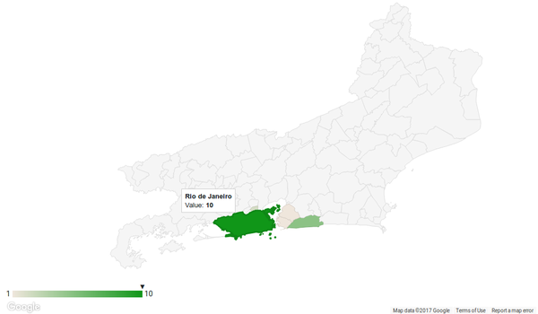

Geochart GeoJSON
================

Create charts very similar to the [Google Charts geochart](https://developers.google.com/chart/interactive/docs/gallery/geochart), but with GeoJSON support.

The Google Charts geochart is a very interesting project. However, it only generates predetermined maps (countries of the world, countries of a continent, states of a country). Althought there is possible to generate high resolution maps (cities of a state or metros of a city), these maps are only available for some specific USA regions.

This project makes possible to draw geocharts in custom and high resolution maps thought GeoJSON.

The above printscreen shows a Geochart GeoJSON in the Rio de Janeiro state, in Brazil.

Requirements
------------

To use this project you need to load the [Google Charts](https://developers.google.com/chart/interactive/docs/) and the [Google Maps API](https://developers.google.com/maps/documentation/javascript/tutorial) before.

Notes
-----

This project implements the Google Chart API and tries to implement an interface similar to the Google Charts geochart component.

However, only a very few features are implemented.
